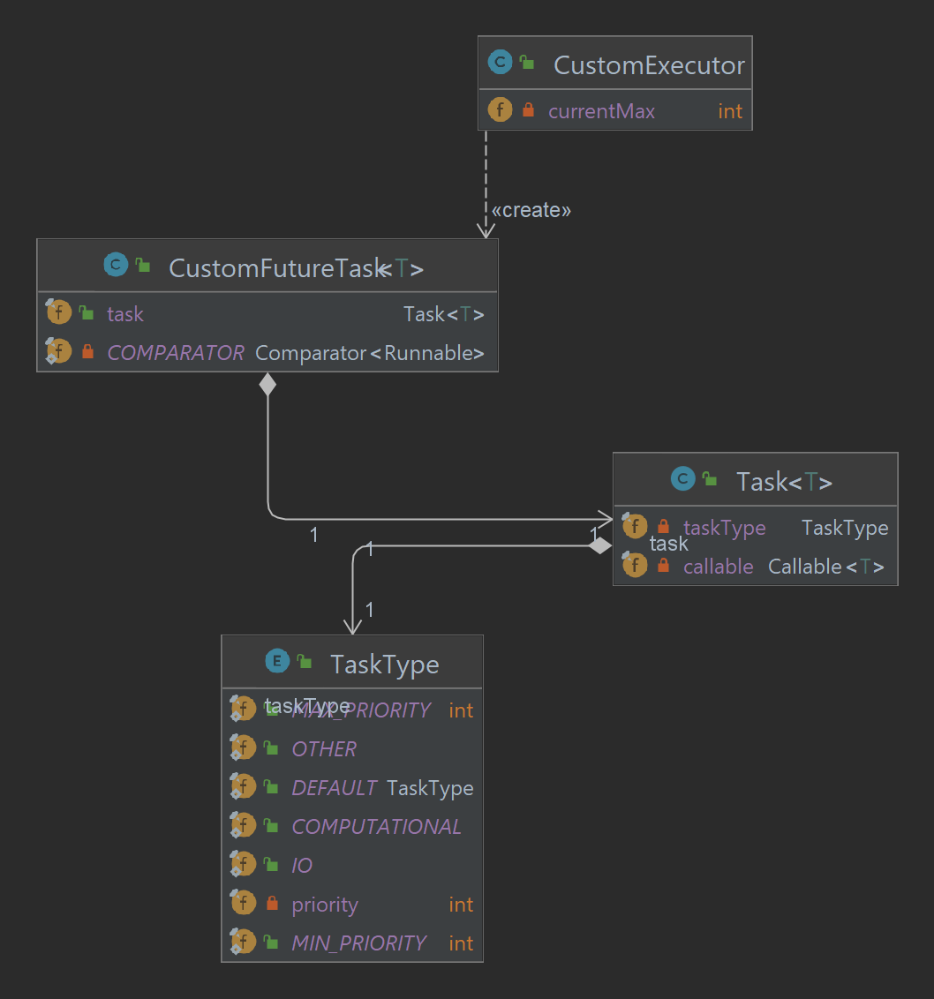

# OOP Assignment 2

This is assignment project for the university

## Requirements

- IntelliJ IDEA
- java 19

## Get Started

Open the project workspace with IDEA, and run "Part A" and 'Part B'

## Part A Results

- 10K files with at max 1K lines. 2510K in total:
  - getNumOfLines take 205 [ms]
  - getNumOfLinesThreads take 424 [ms]
  - getNumOfLinesThreadPool take 1641 [ms]

- 1K files with at max 10K lines. 6251K in total:
    - getNumOfLines take 408 [ms]
    - getNumOfLinesThreads take 134 [ms]
    - getNumOfLinesThreadPool take 172 [ms]

- 10K files with at max 10K lines. 62510K in total:
    - getNumOfLines take 8514 [ms]
    - getNumOfLinesThreads take 2059 [ms]
    - getNumOfLinesThreadPool take 3290 [ms]ss

## Summary on Part B

the core idea of our design is like that, task acts as a normal callable
but has an additional property which is being able to be compared,
custom executor is an extension of threadpool executor which instead
of keeping commands on a regular queue keeps on a priority queue(as in thread pool blocking one to avoid thread problems),
in order to be able to ran compare our tasks with themselves and with normal runnables(which we want to able to run to not hurt threadpool capabilities)
we wrap our tasks in CustomFutureTask much in the same way thread pool executor wraps commands in Future task
. finally all the comparations we do through our enum,which also includes a default value

we have mainly tried to focus on the SOLID principles,
at first we tried to build the custom executor as an executor encapsulating threadpool executor,
we had a hard time incorporating our custom future cleanly into the design.
but then we have noticed that was easier and in a sense more correct
just to extend threadpool executor. this was because of dependency inversion and liskov substitution.
liskov substitution because we wanted a class that acted like threadpool executor and could take its place, so it's supposed to be a subtype of it
,and dependency inversion is the reason our code "didnt look clean" because we tried to change the details of custom executor using higher level design,which is why our code looked messy and hard.

we also often used constructor chaining to ensure less duplicated code and in case of a change,less changes to make
for the same reason and for insuring single responsibility we delegated all our comparations to Task,so if anyone wants to change or know or change how the comparations work he only needs to look in task,
that is unless he wants to know how the comparations work with runnables which arent of the class custom future. that is because custom future is our adapter which bridges the difference between runnable future/runnables which our thread executes,and task which has a type and thus order

## Authors

- Lior Shiboli
- Omer Priel